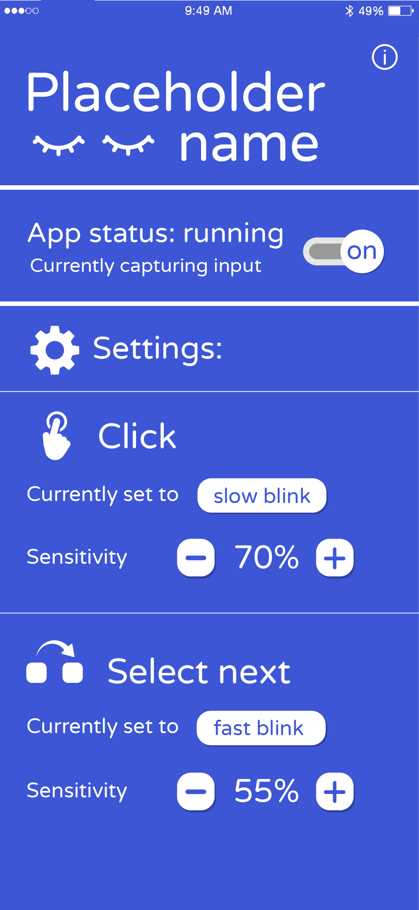
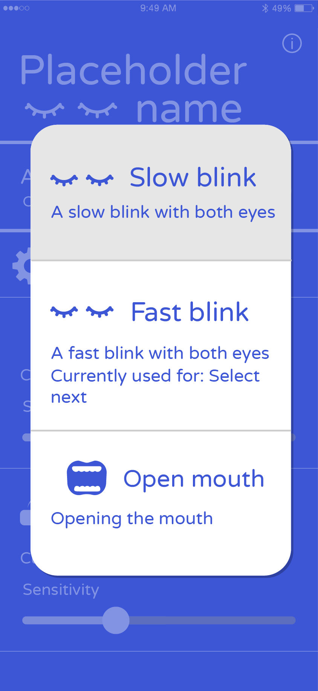
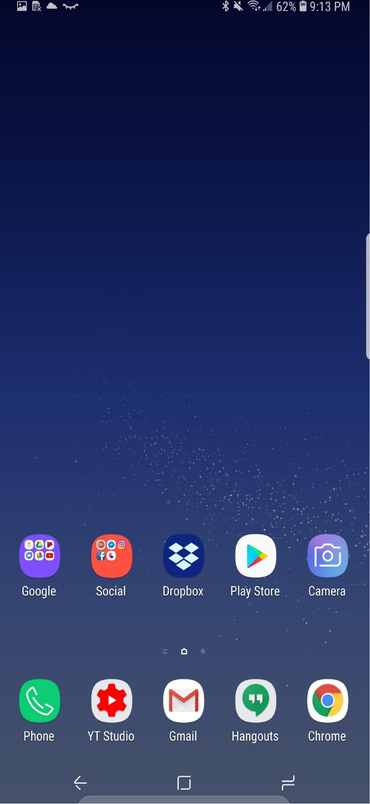
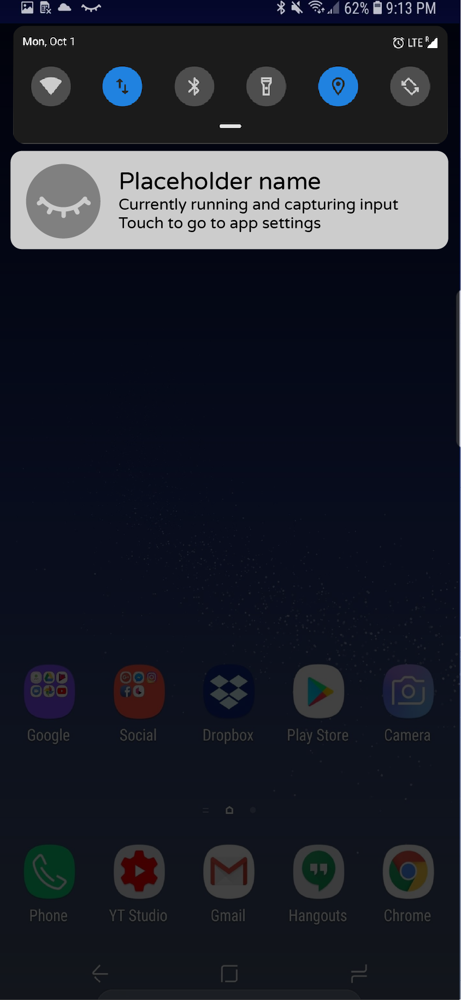

# App GUI mockup

### As it currently stands, the following views of the app has been mocked up:

1. Main view of the app, showing the button for turning it on and off as well as the settings menu on the same page. 
The settings menu could be moved to a separate view, but since the app will mainly run in the background and the UI
will primarily be used for turning the app on and off and accessing the settings, it was felt that it would be reasonable
to have all these features accessible directly from the main menu. The settings allow the user to change the input type
for an action and to change the sensitivity for this specific action. 
1. Menu for selecting input type for different actions, accessible through pressing the currently selected input type 
(eg _slow blink_) for an action type (click, select next etc). The currently selected input type is hightlighted
and if the user tries to change to an input type that's already in use for a different action the app should 
notify the user about this. Clicking outside this menu should close it. (Is this a problem for users navigating the
interface using our app? We'll have to keep this in mind)
1. The home screen of the device with our app running in the background. An app running a forground service has to 
display a persistent notification, but as far as we can tell it would be sufficient to display an icon in the status
bar ([source](https://developer.android.com/guide/topics/ui/notifiers/notifications)) This is seen in the mockup image
where the "blinking eye" symbol is visible.
1. When swiping down on the status bar, the information about the foreground service is displayed in the notification menu,
allowing the user to go to the app and turn it off or change settings.

These mockups should serve as a start point for discussing the interface, and are by no means final. 
